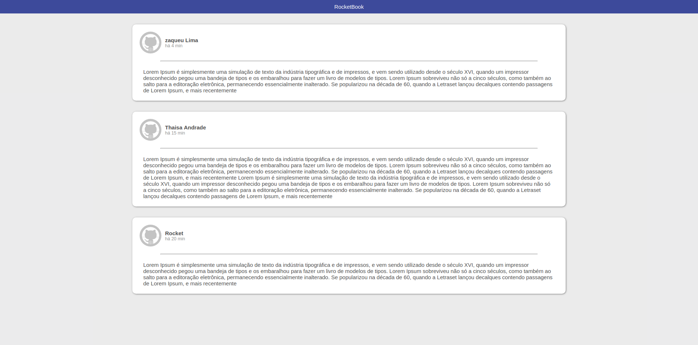

# Bootcamp-Desafio-1

Conteúdos abordados no curso GoStack-5 da Rocketseat

 Tipo: <strong> Projeto Pratico</strong> 

 Instrutor: <strong> Diego Fernandes </strong> 

<h2> Descrição do Projeto: </h2>

Nesse projeto foi desenvolvido um feed de posts estilo Facebook. O desafio foi criar um layout tentando chegar o mais proximo de uma imagem base do projeto

<a href="https://rocketseat.com.br/bootcamp">Veja mais sobre o Bootcamp</a>

